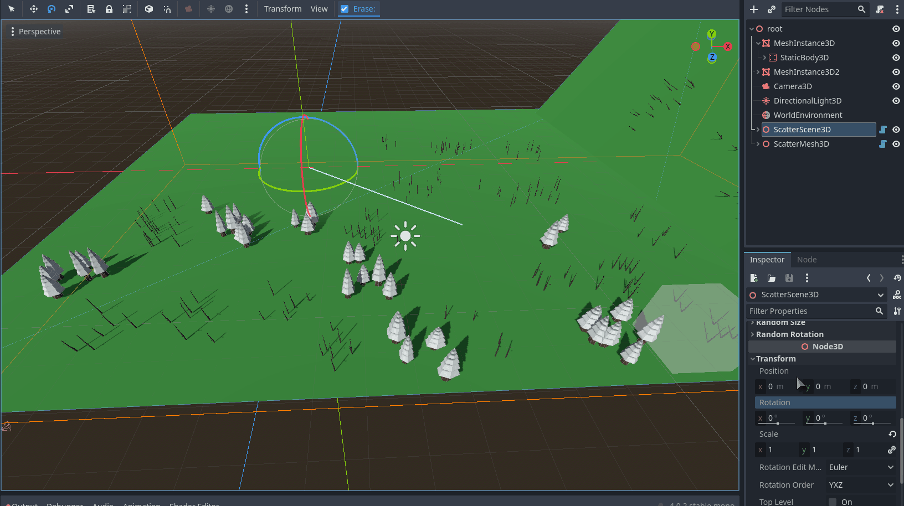

# SCATTERBOX

--- 

This plugin attempts to make level design easier, making it easy to place objects/props such as 
trees, rocks, etc on terrain easily. 
It also allows you to make the props have a random rotation and scale, as well as selecting a
random prop for a pool of props.

Do note that the scatterMesh node requires adding a material to each mesh, and does not
support multiple materials per mesh. It also requires pressing the refresh button upon changing 
the mesh settings. 

--- 

# How to install?

Copy the contents of the addon folder into your own project's addon folder.
(Or download it from the asset library if I have put it on there)

--- 

# Features

- Paint meshes onto terrain
- Paint custom scenes onto terrain
	- these can include collisions or custom code.
- Random rotations and scales to make each object slightly different
- Erase functionality 
	- Press E to quickly toggle between drawing and erasing
- Automatically rotates the meshes to align with the terrain normals
- Scale the draw box with the scroll wheel

--- 

# Examples

